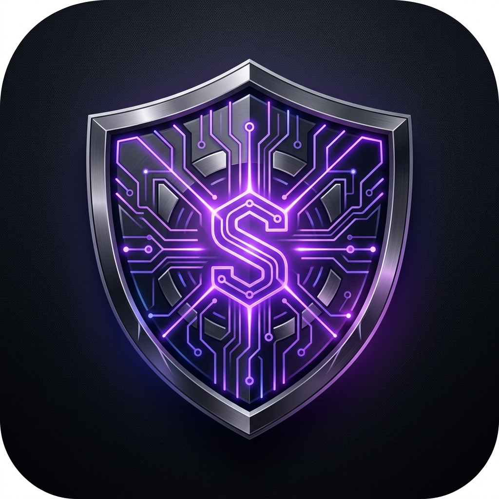

<div align="center">
  
  <h1>🛡️ AEGIS PRO v2.0</h1>
  <p><b>The Ultimate Interactive Cloud Security Learning Platform</b></p>
  <p>
    <a href="#features">Features</a> • 
    <a href="#tech-stack">Tech Stack</a> • 
    <a href="#installation">Installation</a> • 
    <a href="#roadmap">Roadmap</a>
  </p>
</div>

---

## 🚀 Overview
**Aegis Pro** is a high-performance, interactive dashboard designed to guide students and professionals through a complete, step-by-step **Cloud Security Engineering** roadmap. 

Featuring a stunning 3D glassmorphism UI and a custom-built hardware-accelerated rendering engine, Aegis Pro aggregates over 100+ free resources, certification guides, security policies, and an interactive subnet calculator into a single "Mission Control" terminal.

## ✨ Features
* 🔐 **Secure Authentication**: Built-in Google Firebase integration for secure login, registration, and password recovery.
* ⚡ **Zero-Latency Rendering**: Custom `<canvas>` engine utilizing `desynchronized: true` and CSS hardware isolation for butter-smooth 60FPS 3D workspace tilting.
* 🗺️ **Complete Roadmap**: 4 distinct learning phases taking you from foundational networking to expert-level cloud architecture and security.
* 🛠️ **Subnet Calculator**: Interactive IP and CIDR subnetting lab for hands-on networking practice.
* 📚 **Free Resources Hub**: A curated, searchable database of over 100+ free YouTube courses, labs, CTFs, and textbooks.
* 📜 **Compliance & Certifications**: Deep dives into industry standards (NIST, SOC 2, ISO 27001) and certification paths (AWS, CompTIA, OSCP).
* 🌗 **Dynamic Theming**: Seamless Light and Dark mode transitions.

## 💻 Tech Stack
This project was built from the ground up focusing on absolute performance and zero bloat:
* **Frontend**: Pure HTML5, Vanilla JavaScript (ES Modules), and CSS3.
* **UI/UX**: Custom Glassmorphism design system with responsive grid layouts.
* **Backend/Auth**: Google Firebase (Authentication & Session Management).
* **Graphics**: HTML5 Canvas API for particle physics and background rendering.
* **Zero Dependencies**: No React, Vue, or heavy NPM packages. Pure, blazingly fast web native code.

## ⚙️ Installation & Setup

### Running Locally (Offline Mode)
1. Clone the repository:
   ```bash
   git clone https://github.com/yourusername/AegisPro-Web.git
   ```
2. Open the folder and double-click `index.html` to open it in any modern web browser.
3. *Note: Local mode requires bypassing the Firebase check or inputting your own keys.*

### Setting up Firebase (Production Mode)
To enable the secure login and database features:
1. Go to the [Firebase Console](https://console.firebase.google.com/) and create a free project.
2. Enable **Email/Password Authentication** under the `Build > Authentication` tab.
3. Register a "Web App" in your project settings to get your API keys.
4. Open `firebase-auth.js` in the project root.
5. Replace the `firebaseConfig` object with your keys:
   ```javascript
   const firebaseConfig = {
     apiKey: "YOUR_API_KEY",
     authDomain: "your-app.firebaseapp.com",
     projectId: "your-app",
     // ...
   };
   ```

## 🌐 Deployment
Aegis Pro is a static web application and can be deployed for free in seconds:
1. Create an account on [Vercel](https://vercel.com/) or [Netlify](https://netlify.com/).
2. Drag and drop the repository folder into the deploy window, or link your GitHub repository.
3. Your app is instantly live globally!

## 📄 License
This project is open-source and free to use for educational purposes. 

---
<div align="center">
  <i>"Building the next generation of Cloud Security Engineers."</i>
</div>
